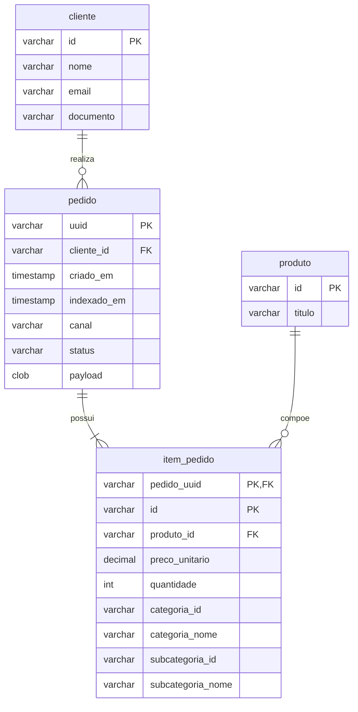

# Questão 1 — Consumidor de pedidos em Java

O comando `-Pedidos` usa consultas Pull repetidas, um pedido por vez, em vez de StreamingPull. Isso evita o ciclo de reconexao por timeout de ping observado neste ambiente. Consultas vazias ou sem retorno no prazo sao informadas no terminal e repetidas com uma pausa de 5 segundos; um timeout nao comprova que a fila esteja vazia. O ACK continua ocorrendo apenas depois da gravacao.

O consumidor recebe JSON do Google Cloud Pub/Sub e persiste os pedidos em H2, um banco relacional salvo em `data/pedidos.mv.db`. Não é necessário instalar um servidor de banco.

## Executar no PowerShell

```powershell
# Popula o banco com uma base de pedidos fictícios, sem acessar a fila nem usar credencial
.\executar.ps1 -Semear -Quantidade 50

# Demonstra a persistência local com um pedido fictício, sem acessar a fila
.\executar.ps1 -DemoPedidos

# Consulta o banco gravado em disco
.\executar.ps1 -ListarPedidos

# Consome continuamente a assinatura do grupo e salva os pedidos reais
.\executar.ps1 -Pedidos

# Executa os testes automatizados
.\executar.ps1 -Testar
```

Instalação, requisitos e erros comuns estão em [como rodar o projeto](como-rodar.md). Repetir `-Semear` com a mesma quantidade e semente não duplica pedidos: os UUIDs gerados são estáveis e a deduplicação por UUID impede a segunda gravação.

Use Ctrl+C para encerrar o consumidor. A assinatura padrão é `projects/serjava-demo/subscriptions/grupo-c`. Se o professor fornecer outra assinatura para pedidos, configure antes de executar:

```powershell
$env:ORDERS_SUBSCRIPTION = 'projects/PROJETO/subscriptions/ASSINATURA'
```

O acesso real anterior dessa assinatura retornou frases, não pedidos. Mensagens precisam seguir o contrato JSON da atividade. O teste local não demonstra que o professor já publicou pedidos na assinatura.

## Como os requisitos são atendidos

- `cliente`: identificador, nome, e-mail e documento.
- `produto`: identificador e título.
- `pedido`: UUID, cliente, data de criação, canal, status e `indexado_em`, preenchido pelo banco no momento da primeira gravação.
- `item_pedido`: chave composta por pedido e ID do item, produto, preço decimal, quantidade e categoria.
- O JSON original fica em `pedido.payload`, preservando seller, shipment, payment e metadata para a próxima etapa.
- Uma transação grava todas as tabelas. Qualquer falha desfaz a gravação inteira.
- O ACK só é solicitado após o commit. Em falhas, o prazo expira sem ACK e permite nova entrega.
- UUID repetido não cria outro pedido nem altera o horário original de indexação. Este consumidor trata cada UUID como um pedido imutável; eventos de atualização exigem versionamento, ausente no contrato fornecido.
- Texto inválido, campos obrigatórios ausentes, IDs de item repetidos e quantidades/preços inválidos são recusados. Mensagens inválidas continuam sujeitas à política de reentrega da assinatura; em produção deve-se configurar uma fila de mensagens rejeitadas.
- Valores totais não são persistidos: podem ser calculados a partir de preço unitário e quantidade.

## DER



O SQL está em `src/main/resources/schema.sql`. O PDF tem exemplos de status divergentes (`separated` no payload e outros na lista); por isso o consumidor preserva o status recebido, sem impor uma lista fechada.

## Entrega

Demonstre a gravação e a listagem em execuções separadas. Execute a demonstração duas vezes para mostrar que o pedido não duplica. Para demonstrar o fluxo real, execute `-Pedidos` durante a publicação do professor e depois consulte com `-ListarPedidos`.

O enunciado também exige fontes no Git e commits de todos os membros. Cada integrante deve realizar seus próprios commits. Credencial, banco local e ferramentas estão no `.gitignore`.

Referências: [H2 e persistência local](https://h2database.com/html/features.html), [recebimento no Pub/Sub](https://docs.cloud.google.com/pubsub/docs/pull-messages).
